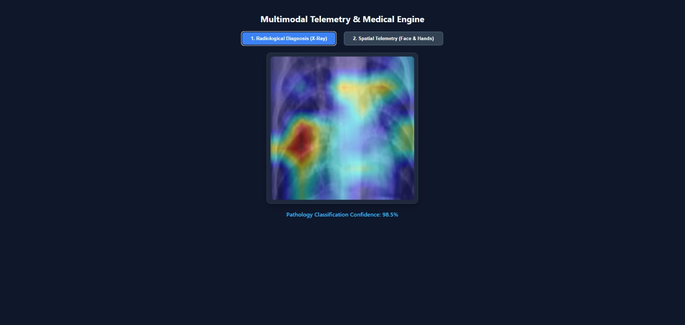
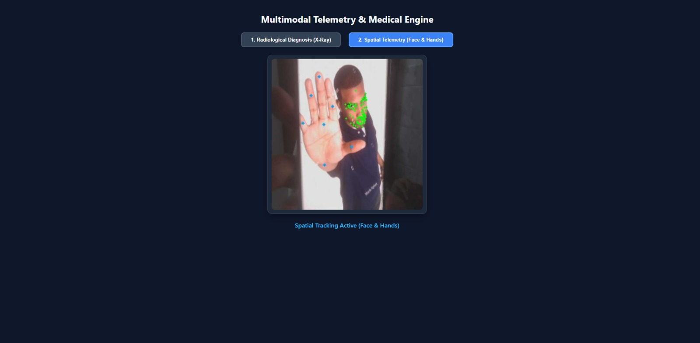

# Multimodal Medical Telemetry Engine

## Overview
A dual-mode, real-time computer vision and diagnostic telemetry engine. This project utilizes a FastAPI WebSocket backend to stream and process webcam frames entirely in-memory. It serves as an experimental framework for combining deep learning radiological classification with spatial kinematic tracking.

### Core Features
1. **Radiological Diagnosis Mode (Explainable AI):** Evaluates chest radiographs for pneumonia using a custom PyTorch ResNet50 model. It features a Gradient weighted Class Activation Mapping (Grad-CAM) hook to visually highlight the neural network focal regions.
2. **Spatial Telemetry Mode:** Extracts real-time face mesh and hand landmark coordinates via Google MediaPipe for downstream kinematic tracking.
3. **Zero-Disk I/O Processing:** All frame extraction, tensor transformation, and overlay generation occurs in RAM via base64 WebSocket payloads to ensure zero residual data leakage.

## Demo

### Mode 1: Radiological Diagnosis (Grad-CAM)


### Mode 2: Spatial Telemetry (Face and Hands)


## Tech Stack
* **Backend Framework:** Python, FastAPI, Uvicorn, WebSockets
* **Deep Learning:** PyTorch, TorchVision
* **Spatial Tracking:** Google MediaPipe (Face Mesh, Hands)
* **Computer Vision:** OpenCV, Pillow
* **Dataset:** MedMNIST (PneumoniaMNIST)
* **Frontend:** Vanilla HTML5, JavaScript, Canvas API

## Setup and Installation

### 1. Install Dependencies
Ensure you have Python installed, then install the required packages:
```bash
pip install fastapi uvicorn websockets torch torchvision opencv-python mediapipe pillow medmnist
